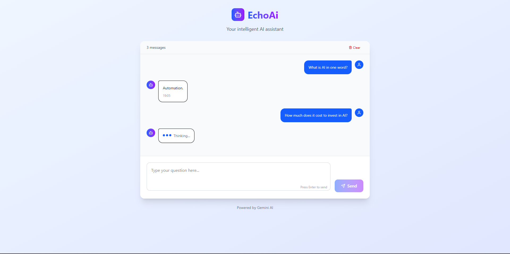

# EchoAi 🧠💬

A modern React-based AI chatbot powered by **Google's Gemini API**, styled with **Tailwind CSS**, and enhanced using **Lucide icons**.

## 🚀 Features

- ✨ Beautiful, responsive UI with Tailwind CSS
- 💬 Dynamic chat interface with user and AI messages
- ⚡ Instant responses via Gemini 2.0 Flash model
- 🎯 Typing indicator and error handling
- 🧹 Clear conversation history
- 🔒 Uses `axios` for API calls

---

## 📸 Preview



---

## 🛠️ Tech Stack

- **React**
- **Tailwind CSS**
- **Axios**
- **Lucide Icons**
- **Google Gemini API (v1beta)**

---

## ⚙️ Setup & Installation

```bash
# 1. Clone the repo
git clone https://github.com/your-username/echoai-chat-app.git
cd echoai-chat-app

# 2. Install dependencies
npm install

# 3. Run the app
npm run dev 
```

> 💡 Make sure you replace `YOUR_API_KEY` inside the Gemini API call with your actual Google API key.

---

## 🔑 API Configuration

Go to `App.js` and update this line with your API key:

```js
apiUrl: "https://generativelanguage.googleapis.com/v1beta/models/gemini-2.0-flash:generateContent?key=YOUR_API_KEY"
url: `${apiUrl}:generateContent?key=${apiKey}`,
```

---

## 📂 Project Structure

```
echoai-chat-app/
│
├── public/              # Static files
├── src/
│   ├── App.js           # Main chat interface
│   └── index.js         # Entry point
├── package.json
├── tailwind.config.js
└── README.md
```

---

## 📄 License

MIT License

---

## 🙌 Acknowledgements

- [Google Gemini API](https://ai.google.dev/)
- [Lucide Icons](https://lucide.dev/)
- [Tailwind CSS](https://tailwindcss.com/)

